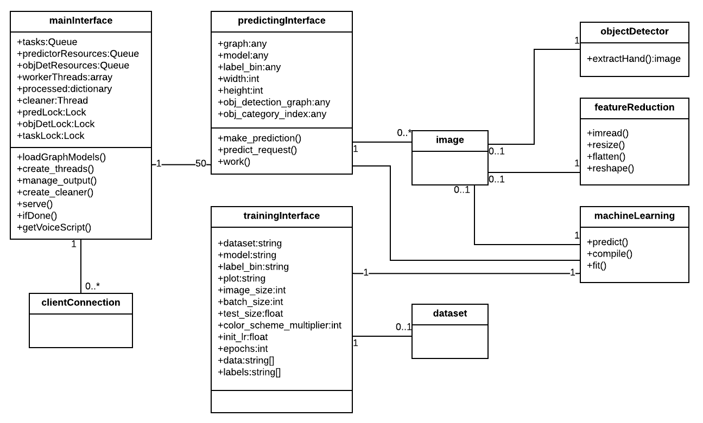

# SSTST
Sinhala sign language to speech translator app which works by communicating with a back-end server. (Initial development is only concerned with few signs).

## Introduction
Sign language is a visual language use to communicate with people who are suffering from hearing loss and get little or no benefit from technology. Sign language typically involves with hand shapes, facial expression, gestures and body language. Over 466 million people in the world are suffering from hearing loss. That is almost over 5% of the world’s population. From that, over three hundred thousand are Sri Lankan people. These people uses a sign language which may specific to their country or parent’s mother tongue. When considering Sri Lankan sign language, there are more than 350 signs under various categories. They can be classified into static signs and dynamic signs. Most deaf people use some of these signs or may be all of them according to their preference. For many deaf children, this is the language which they gain education. But unfortunately most of the ordinary people doesn’t understand these sign languages.

This Sinhala sign to speech translator application can provide a useful solution to this problem. The app takes a video clip which contains Sinhala sign language and translates it into Sinhala speech. User can either upload a video from the gallery or record it using the device camera. Then the application communicate with the server and output Sinhala text along with a voice clip. By using this app, an ordinary person could easily understand what a deaf person saying without knowing a single sign.

## Scope
This project will cover the Sinhala sign language covering the categories such as numbers and WH questions (what, when, how, etc.). This project is only concerned about translating words in sign language.

## Project Structure
### Architecture Diagram

### Class Diagram

## Dataset
The sinhala sign dataset created for this project can be found in this link. Download the dataset, extract it and copy content to a folder named 'signs_dataset' inside the 'Server' folder.
https://www.kaggle.com/thamindudilshan/sinhala-sign-language-dataset-tdj

